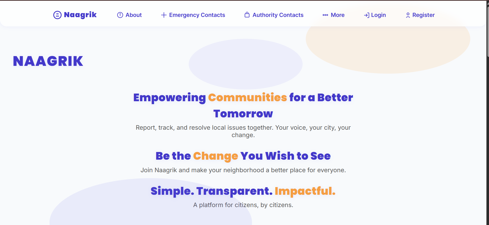
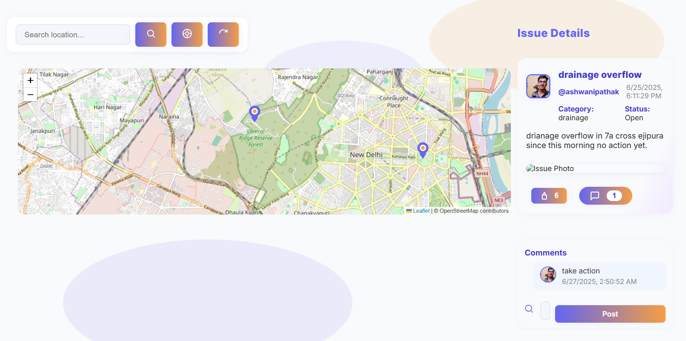
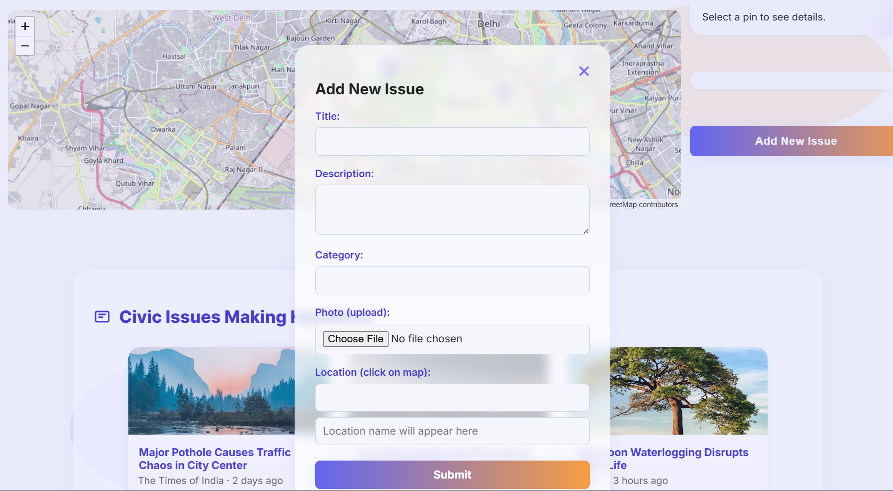
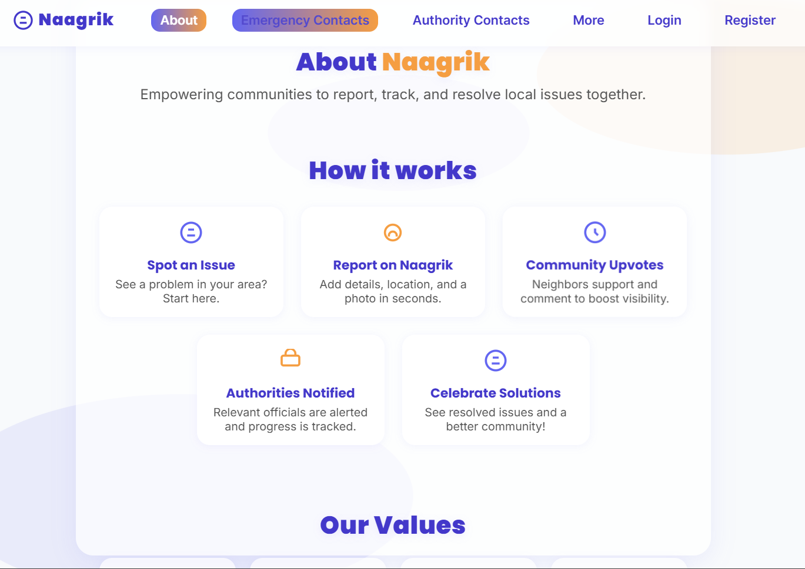
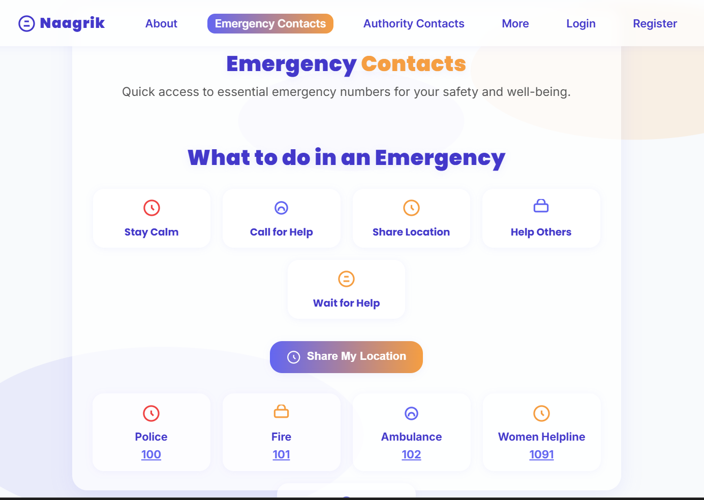
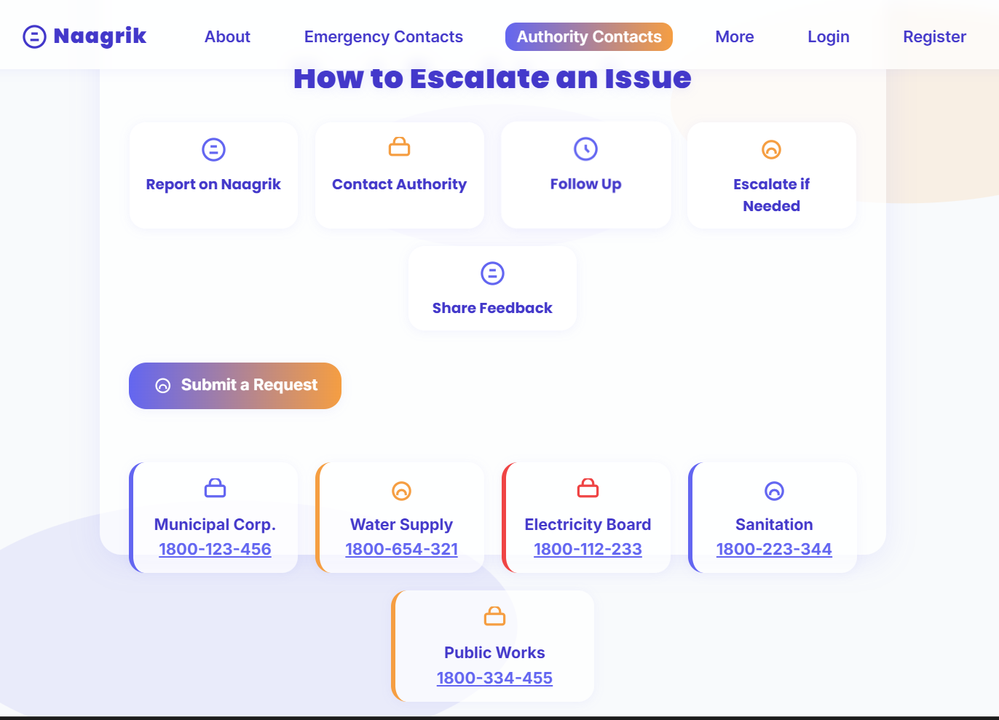
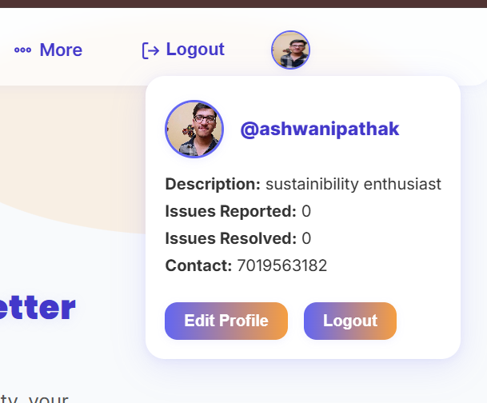
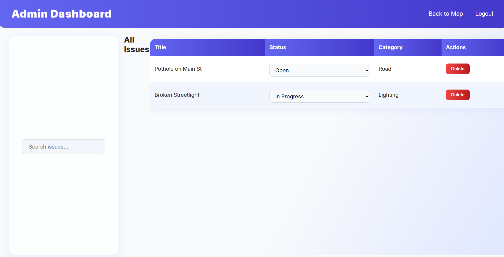

# Naagrik 🚦

**Empowering Communities for a Better Tomorrow**

---

## 🌐 Live Demo

- **Frontend (Vercel):** [https://naagrik-chi.vercel.app]
- **Backend (Render):** [https://naagrik.onrender.com/api]

> Replace the above links with your actual deployed URLs.

---

Naagrik is a modern, social-media-inspired civic issue reporting platform. It enables citizens to report, track, and resolve local issues collaboratively, making neighborhoods safer, cleaner, and more responsive.

---

## 🌟 Features

### 🗺️ Interactive Map
- View and report civic issues directly on a real-time map (powered by Leaflet.js).
- Click on the map to select a location for your report.
- See all open, in-progress, and resolved issues in your city.

### 📰 Social Feed & Issue Details
- Issues are displayed in a social-media-like feed with avatars, upvotes, comments, and status.
- Each issue shows:
  - User avatar and profile info
  - Title, description, category, and status
  - Location name (reverse geocoded)
  - Uploaded photo
  - Upvote and comment counts
  - Toggleable comment section

### 🗣️ Comments & Upvotes
- Users can upvote issues to signal importance.
- Add comments to discuss or provide updates on issues.
- Comment counts and avatars shown for each comment.

### 👤 User Profiles
- Each user has a profile with:
  - Custom avatar (image upload)
  - Username, description/bio, and contact info
  - Stats: issues reported, issues resolved
- Profile dropdown in navbar for quick access.
- Full profile editing modal.

### 🖼️ Image Uploads
- Upload images for both issues and user avatars.
- Images are stored and served from the backend (or cloud storage in production).

### 📍 Reverse Geocoding
- Issues display a human-readable location name using OpenStreetMap's Nominatim API.

### 📊 Infographics & Real Data
- Animated counters for issues reported, resolved, and active users.
- Infographic sections explaining the platform's impact and workflow.

### 🏢 Authority & Emergency Contacts
- Quick-access cards for municipal, water, electricity, sanitation, and public works contacts.
- Emergency contacts and share location feature.

### 🛡️ Admin Dashboard
- Admins can manage users, issues, and comments.
- Change issue status, delete inappropriate content, and more.

### 🖼️ Civic Problem Gallery & User Stories
- Gallery of common civic problems with images.
- Real user stories and testimonials.

### 🔒 Authentication & Security
- JWT-based authentication for secure login and registration.
- Passwords are hashed and never stored in plain text.

---

## 🖼️ Screenshots

> Add screenshots of your app below for best effect! Place your images in a `screenshots/` folder in the repo and update the paths as needed.

| Home Page | Map & Issue Feed | Issue Modal | About Page |
|:---------:|:----------------:|:-----------:|:----------:|
|  |  |  |  |

| Emergency Page | Authority Page | Profile Dropdown | Admin Dashboard |
|:--------------:|:--------------:|:----------------:|:---------------:|
|  |  |  |  |

---

## 🛠️ Tech Stack

- **Frontend:** HTML, CSS, JavaScript (Vanilla), [Leaflet.js](https://leafletjs.com/)
- **Backend:** Node.js, Express.js, MongoDB (Mongoose)
- **Authentication:** JWT
- **Image Uploads:** Multer (local `/uploads` or cloud storage)
- **Reverse Geocoding:** OpenStreetMap Nominatim API
- **Deployment:** Vercel (Frontend), Render (Backend)
- **Email Notifications:** Nodemailer (for admin/authority alerts)

---

## 🚀 Getting Started

### 1. Clone the Repository
```sh
git clone https://github.com/Ashwani-Pathak/naagrik.git
cd naagrik
```

### 2. Setup Backend
```sh
cd backend
npm install
# Create a .env file with MONGO_URI, JWT_SECRET, SMTP config, etc.
npm start
```

### 3. Setup Frontend
```sh
cd ../frontend
# Open index.html in your browser (or deploy to Vercel)
```

### 4. Environment Variables (Backend)
```
MONGO_URI=your_mongodb_connection_string
JWT_SECRET=your_jwt_secret
ADMIN_EMAIL=admin@example.com
SMTP_HOST=smtp.example.com
SMTP_PORT=587
SMTP_USER=your_smtp_user
SMTP_PASS=your_smtp_pass
SMTP_SECURE=false
```

---

## 🌍 Deployment

- **Frontend:** Deploy `/frontend` to [Vercel](https://vercel.com/)
- **Backend:** Deploy `/backend` to [Render](https://render.com/)
- Update `API_BASE` in `frontend/api.js` to your backend URL after deployment.

---

## 🤝 Contributing

1. Fork this repo
2. Create a new branch (`git checkout -b feature/your-feature`)
3. Commit your changes (`git commit -am 'Add new feature'`)
4. Push to the branch (`git push origin feature/your-feature`)
5. Open a Pull Request

---

## 📄 License

MIT

---

> Made with ❤️ for civic engagement and community empowerment. 